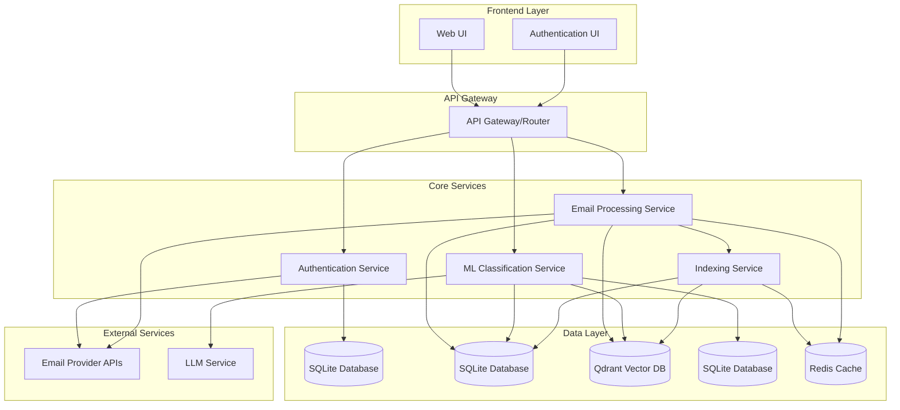

# Design Document

## Overview

The Intelligent Email Filter system is a web-based application that provides automated email importance classification using machine learning. The system integrates with email providers via OAuth, maintains an incremental indexing pipeline, and uses an LLM to learn user preferences for email importance filtering.

The architecture follows a microservices pattern with clear separation between authentication, email processing, machine learning, and user interface components. The system is designed for scalability and reliability with proper error handling and data consistency mechanisms.

## Architecture



## Components and Interfaces

### Authentication Service
**Purpose:** Handles user authentication and OAuth integration with email providers

**Key Interfaces:**
- `POST /auth/login` - Initiate OAuth flow for @ashoka.edu.in emails
- `POST /auth/callback` - Handle OAuth callback and token exchange
- `POST /auth/refresh` - Refresh expired tokens
- `GET /auth/status` - Check authentication status

**Key Classes:**
- `AuthController` - HTTP request handling
- `OAuthManager` - OAuth flow management
- `TokenStore` - Secure token storage and retrieval
- `DomainValidator` - Email domain validation

### Email Processing Service
**Purpose:** Manages email retrieval, parsing, and metadata extraction

**Key Interfaces:**
- `GET /emails` - Retrieve filtered emails for user
- `POST /emails/sync` - Trigger manual email synchronization
- `GET /emails/search` - Full-text search across emails
- `PUT /emails/{id}/importance` - Update email importance classification

**Key Classes:**
- `EmailController` - HTTP request handling
- `EmailSyncManager` - Orchestrates email synchronization
- `EmailParser` - Extracts metadata from raw emails
- `EmailRepository` - Database operations for emails

### Indexing Service
**Purpose:** Handles incremental email indexing, vector embedding generation, and maintains sync state

**Key Interfaces:**
- `POST /index/full` - Trigger complete re-indexing with vector embeddings
- `POST /index/incremental` - Process new emails since last sync
- `GET /index/status` - Get indexing progress and statistics
- `POST /index/embeddings` - Generate embeddings for existing emails

**Key Classes:**
- `IndexingController` - HTTP request handling
- `IncrementalIndexer` - Manages incremental indexing logic
- `VectorEmbeddingService` - Generates embeddings for email content
- `SyncStateManager` - Tracks last sync timestamps and states
- `EmailFetcher` - Retrieves emails from provider APIs

### ML Classification Service
**Purpose:** Manages LLM training and email importance classification

**Key Interfaces:**
- `POST /ml/train` - Train model with user-provided examples
- `POST /ml/classify` - Classify email importance
- `GET /ml/model-status` - Get training status and model metrics

**Key Classes:**
- `MLController` - HTTP request handling
- `LLMTrainer` - Manages model training with user examples
- `EmailClassifier` - Performs email importance classification
- `TrainingDataManager` - Manages training examples and validation

## Data Models

### User Model
```typescript
interface User {
  id: string;
  email: string; // Must end with @ashoka.edu.in
  createdAt: Date;
  lastLoginAt: Date;
  oauthTokens: {
    accessToken: string;
    refreshToken: string;
    expiresAt: Date;
  };
  preferences: {
    autoClassify: boolean;
    confidenceThreshold: number;
  };
}
```

### Email Model
```typescript
interface Email {
  id: string;
  userId: string;
  messageId: string; // Provider's unique message ID
  subject: string;
  sender: string;
  recipients: string[];
  content: string;
  htmlContent?: string;
  receivedAt: Date;
  indexedAt: Date;
  importance: 'important' | 'not_important' | 'unclassified';
  importanceConfidence?: number;
  userLabeled: boolean; // True if user manually classified
  vectorId?: string; // Reference to vector embedding in vector DB
  metadata: {
    hasAttachments: boolean;
    threadId?: string;
    labels: string[];
  };
}

interface EmailVector {
  id: string;
  emailId: string;
  userId: string;
  embedding: number[]; // Vector embedding of email content
  embeddingModel: string; // Model used to generate embedding
  createdAt: Date;
}
```

### Training Example Model
```typescript
interface TrainingExample {
  id: string;
  userId: string;
  emailId: string;
  importance: 'important' | 'not_important';
  createdAt: Date;
  features: {
    subject: string;
    sender: string;
    content: string;
    hasAttachments: boolean;
  };
}
```

### Sync State Model
```typescript
interface SyncState {
  userId: string;
  lastSyncAt: Date;
  lastMessageId?: string;
  totalEmailsIndexed: number;
  isInitialSyncComplete: boolean;
  currentSyncStatus: 'idle' | 'syncing' | 'error';
  lastError?: string;
}
```

## Error Handling

### Authentication Errors
- **Invalid Domain:** Return 400 with clear message about @ashoka.edu.in requirement
- **OAuth Failures:** Implement retry logic with exponential backoff
- **Token Expiry:** Automatic refresh with fallback to re-authentication

### Email Provider Integration
- **Google Workspace Integration:** Use Gmail API with OAuth 2.0 for @ashoka.edu.in accounts
- **Rate Limiting:** Implement request queuing and respect Gmail API limits
- **API Downtime:** Queue operations for retry when service recovers
- **Partial Failures:** Continue processing remaining emails, log failures

### Database Operations
- **SQLite Operations:** Use WAL mode for better concurrent access
- **Transaction Failures:** Use database transactions for data consistency
- **Data Corruption:** Implement data validation and integrity checks
- **Qdrant Integration:** Handle vector operations with proper error handling

### ML Service Integration
- **LLM Unavailability:** Fallback to showing all emails with notification
- **Classification Errors:** Log errors and mark emails as unclassified
- **Training Failures:** Provide user feedback and retry mechanisms

## Testing Strategy

### Unit Testing
- **Service Layer:** Test business logic with mocked dependencies
- **Data Layer:** Test repository patterns with in-memory databases
- **Utilities:** Test email parsing, domain validation, and data transformations
- **Target Coverage:** 90% code coverage for core business logic

### Integration Testing
- **API Endpoints:** Test complete request/response cycles
- **Database Integration:** Test with real database instances
- **OAuth Flow:** Test authentication flow with mock providers
- **Email Processing:** Test end-to-end email indexing pipeline

### End-to-End Testing
- **User Workflows:** Test complete user journeys from login to email filtering
- **Email Synchronization:** Test incremental and full sync scenarios
- **ML Training:** Test model training and classification workflows
- **Error Scenarios:** Test system behavior under various failure conditions

### Performance Testing
- **Email Indexing:** Test performance with large email volumes (10k+ emails)
- **Search Performance:** Test search response times with full-text queries
- **Concurrent Users:** Test system behavior with multiple simultaneous users
- **Memory Usage:** Monitor memory consumption during large indexing operations

### Security Testing
- **Authentication:** Test OAuth security and token handling
- **Authorization:** Verify users can only access their own emails
- **Data Protection:** Test encryption of sensitive data at rest and in transit
- **Input Validation:** Test against injection attacks and malformed data